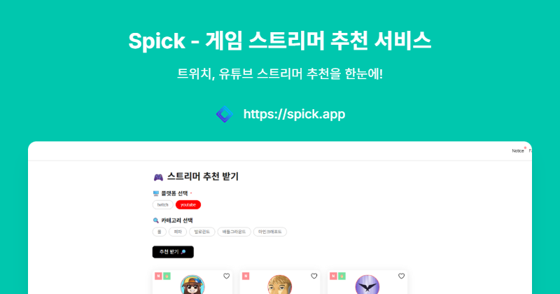

# Spick - 게임 스트리머 추천 서비스



> ⚠️ **안내**: 이 서비스는 현재 종료되었습니다. 그동안 이용해 주셔서 감사합니다.

## 📌 프로젝트 소개

Spick은 다양한 플랫폼(유튜브, 트위치, 치지직)의 게임 스트리머를 키워드 기반으로 추천해주는 서비스입니다. 사용자가 선호하는 게임 카테고리와 플랫폼을 선택하면 그에 맞는 스트리머를 찾아볼 수 있습니다.

## ✨ 주요 기능

- **멀티 플랫폼 지원**: 유튜브, 트위치, 치지직 등 다양한 스트리밍 플랫폼의 스트리머 정보 제공
- **게임 카테고리별 필터링**: 롤, 피파, 발로란트, 배틀그라운드 등 다양한 게임 카테고리로 필터링
- **즐겨찾기 기능**: 관심 있는 스트리머를 즐겨찾기에 추가 가능
- **실시간 정보**: 트위치 스트리머의 라이브 상태 실시간 확인
- **반응형 디자인**: 모바일, 데스크톱 등 다양한 화면 크기 지원
- **다크모드 지원**: 사용자 선호에 따른 다크/라이트 모드 전환

## 🛠️ 기술 스택

- **프론트엔드**: Next.js 14, Tailwind CSS, React
- **백엔드/데이터베이스**: Supabase
- **배포**: Vercel
- **API**: YouTube Data API, Twitch API, Chzzk API

## 🗂️ 프로젝트 구조

```
spick/
├── public/
├── src/
│   ├── app/
│   │   ├── api/
│   │   ├── streamer/
│   │   ├── about/
│   │   ├── notice/
│   │   ├── page.tsx
│   │   └── ...
│   ├── components/
│   │   ├── layout/
│   │   ├── ui/
│   │   └── ...
│   ├── lib/
│   │   ├── api/
│   │   ├── utils/
│   │   └── ...
│   ├── store/
│   ├── types/
│   └── ...
├── scripts/
│   ├── youtube/
│   ├── twitch/
│   └── chzzk/
└── ...
```

## 📊 데이터베이스 구조

프로젝트는 각 플랫폼별로 스트리머, 게임 카테고리, 스트리머-카테고리 연결 테이블로 구성되어 있습니다:

- **스트리머 테이블**: 플랫폼별 스트리머 정보 저장 (채널 ID, 이름, 설명, 프로필 이미지 등)
- **게임 카테고리 테이블**: 게임 카테고리 정보 저장
- **스트리머-카테고리 연결 테이블**: 스트리머와 게임 카테고리 간의 관계 저장
- **공지사항 테이블**: 서비스 공지사항 관리

## 🔄 데이터 수집 및 갱신

- 유튜브 API를 통한 채널 정보 수집
- 트위치 API를 통한 스트리머 정보 및 실시간 방송 상태 확인
- 치지직 스트리머 정보 수집 (개발 중)
- Github Actions를 활용한 데이터 자동 갱신

## 🎨 UI/UX 특징

- 심플하고 직관적인 인터페이스
- 스트리머 카드 형태의 정보 제공
- 플랫폼별 색상 테마 적용 (유튜브: 빨강, 트위치: 보라, 치지직: 초록)
- 다크모드/라이트모드 전환 기능
- 반응형 디자인으로 모든 디바이스 지원

## 🚀 설치 및 실행 방법

```bash
# 저장소 클론
git clone https://github.com/jtothemoon/streamer-recommender
cd spick

# 의존성 설치
npm install

# 개발 서버 실행
npm run dev

# 빌드
npm run build

# 프로덕션 서버 실행
npm start
```

## 🔗 관련 링크

- 배포 URL: [https://spick.app](https://spick.app) (서비스 종료)
- 개발자 블로그: [블로그 링크]

---

© 2025 Spick. All Rights Reserved.